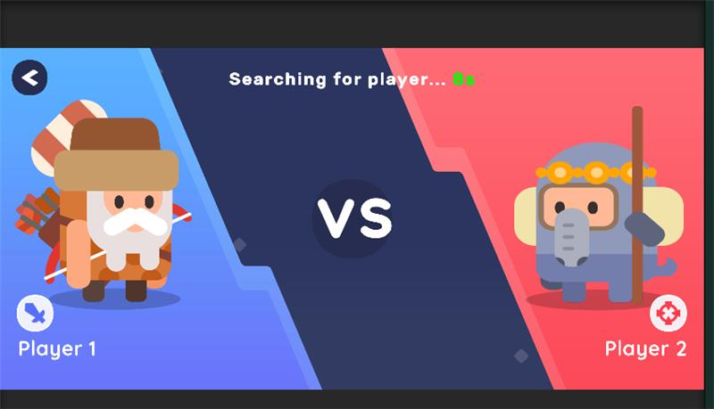
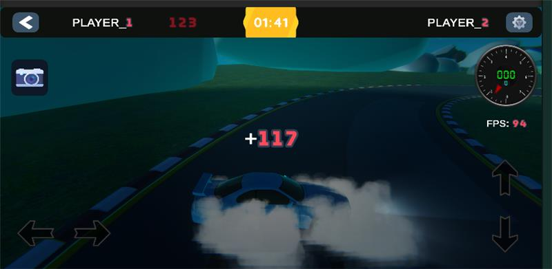
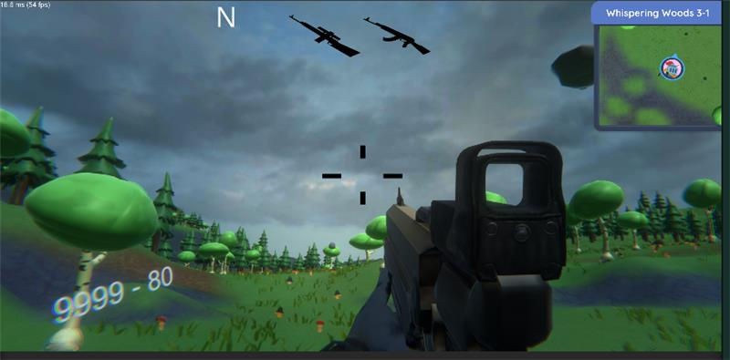

# 🎮 Unity Game Portfolio

A collection of three small-but-complete Unity games showcasing multiplayer, AI, physics, and moment-to-moment gameplay polish.

* **Rolling-Dice** — Turn-based online/AI board game with synchronized dice and tile abilities.
* **Car Drift** — Arcade drift racer with tuned physics, ghost system, and mobile-friendly controls.
* **Top‑Down Shooter** — Wave-based survival shooter with weapon pickups and aim-assist.

> Unity 2021.3+ recommended for all projects. Tested on Android and Windows builds.

---

## 🧩 Rolling-Dice (Multiplayer)

### 📌 Features

* 2‑Player online matches (Photon PUN 2)
* Optional **AI** opponent with shared rules
* **Synchronized dice animation** (DOTween)
* **Tile abilities** (forward/back, jump, finish)
* **Dynamic camera** and clean UI (TMP)
* **Turn Manager** handling AI vs Online logic

### 🛠️ Technologies

`Unity 2021.3+`, `Photon PUN 2`, `DOTween`, `TextMeshPro`

### ▶️ How to Run

1. Open `Assets/RollingDice/Scenes/Lobby.unity`.
2. In *PhotonServerSettings*, set your **Photon AppId**.
3. Press **Play** → choose **AI Match** or **Multiplayer Match**.

### 🧪 Testing Tips

* Use **Editor + Build** to simulate two clients locally.
* Check Photon console for **ActorNumbers**.
* Add `Debug.Log` in `GameManager`, `DiceRoller`, `PhotonManager`.

### 🎮 Controls

* **Left Click / Tap**: Roll dice / Confirm turn

### 📸 Screenshots

Place images under `Assets/RollingDice/Images/` and reference them:

`

---

## 🚗 Car Drift (Arcade)

### 📌 Features

* **Arcade drift physics** tuned for smooth, controllable slides
* **Speed-based traction** + **counter-steer assist** (optional)
* **Ghost system**: record & replay best lap
* **Mobile-friendly UI** with on‑screen steering & brake
* **Dynamic camera** (follow + look‑ahead)
* **Lap timer**, checkpoints, and basic leaderboard hooks

### 🛠️ Technologies

`Unity 2021.3+`, `Rigidbody` wheel/axle model, `Cinemachine` (optional), `TextMeshPro`

### ▶️ How to Run

1. Open `Assets/CarDrift/Scenes/Track.unity`.
2. Press **Play** → choose **Arcade** physics preset.
3. (Optional) Toggle **Drift Assist** in the HUD to learn lines.

### 🎮 Controls

* **Keyboard**: WASD/Arrows drive, **Space** handbrake, **R** reset
* **Gamepad**: Sticks to steer/accel, **A/X** handbrake
* **Mobile**: On‑screen steer, brake, and nitro buttons

### 📸 Screenshots

Add images under `Assets/CarDrift/Images/`:

---

## 🔫 Top‑Down Shooter (Survival)

### 📌 Features

* **Twin‑stick** movement and shooting
* **Wave manager** with scaling difficulty
* Enemies: chasers, ranged, and heavy units
* **Weapon pickups** (SMG/Shotgun/AR) + reloads
* **Aim assist** (mobile friendly) and damage feedback
* **Perks**: movement speed, fire rate, lifesteal (ScriptableObjects)

### 🛠️ Technologies

`Unity 2021.3+`, `ScriptableObjects`, `Object Pooling`, `TextMeshPro`

### ▶️ How to Run

1. Open `Assets/Shooter/Scenes/Arena.unity`.
2. Press **Play** → Start Wave 1.

### 🎮 Controls

* **Keyboard/Mouse**: WASD move, Mouse aim/shoot, **R** reload, **Q/E** cycle
* **Gamepad**: LS move, RS aim/shoot, **X/□** reload
* **Mobile**: Dual virtual sticks (left move / right aim + auto‑fire)

### 📸 Screenshots

Add images under `Assets/Shooter/Images/`:

---

## 🧰 Shared Packages

* **DOTween** — juice for UI and dice
* **Cinemachine** — optional camera rigs
* **TextMeshPro** — crisp UI text

Install via *Package Manager* or include under `Assets/Plugins`.

---

## 🧪 Multi‑Project Testing

* Use **Development Build** with **Autoconnect Profiler** to profile physics & GC.
* Target **60 FPS** mobile; cap with **Application.targetFrameRate**.
* Prefer **Object Pooling** for bullets and VFX.

---

## 📃 License

Educational & prototyping use. Modify and extend freely. Attribution appreciated.

---

## 👤 Author

**Aman Chauhan**
Unity Developer — Multiplayer • AI • Firebase • Web3 • Gameplay Systems

* Email: [your.email@example.com](mailto:amanchauhan0202@gmail.com)

> Replace contact links and drop real screenshots into the indicated `Images/` folders for a polished portfolio README.
